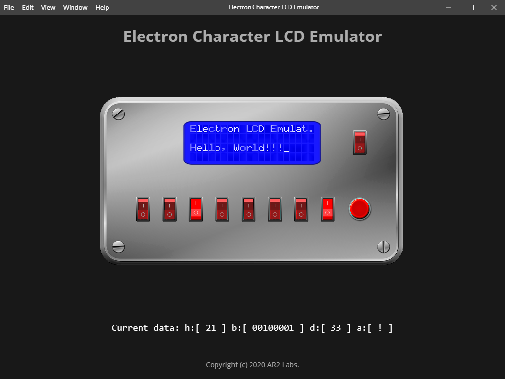

# Electron Character LCD Emulator

This Character LCD Emulator can be used to learn how the HD44780 works.

The HD44780 is easy to interface, and very robust. They come in sizes 20x2 or 20x4 and even larger, but they almost all have the same pinout, and there are libraries in many embedded environments for interacting with them.

We decided to make an interface with an Character LCD using only images and the [vrEmuLcd](https://github.com/visrealm/vrEmuLcd), with the intent of illustrating exactly how to use them, and how easy they are.

Use your keyboard to write and the arrows to navigate on the display,
and the software shows how the switches are working.

This project is used only for dictative purposes and was inspired by the video tutorial [How a Character LCD works](https://www.youtube.com/watch?v=hZRL8luuPb8)
of the 8-Bit Guy Channel.

## To run this application:

1. Install dependencies: `npm install`
2. Start the app: `npm start`

## Screenshot:

## License

vrEmuLcd are released under the [MIT license](https://github.com/visrealm/vrEmuLcd/blob/master/LICENSE).

Electron Character LCD Emulator are released under the [MIT license](https://github.com/arcostasi/electron-lcdemu/blob/master/LICENSE)
